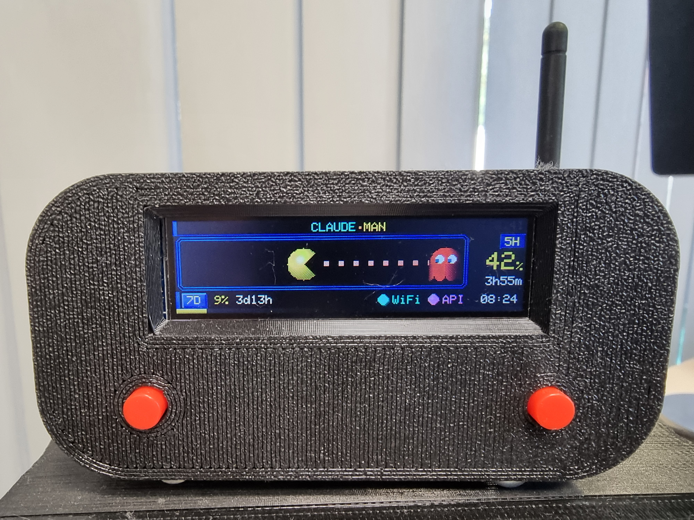

# CLAUDE·MAN

A physical dashboard for monitoring [Claude Code](https://claude.ai/code) session usage limits, built on an ESP32-C3 SuperMini with a tiny 76×284 ST7789 display.

Polls the Anthropic OAuth usage API every 3 minutes and renders a Pac-Man animation where Pac-Man's position reflects how much of your 5-hour usage window has been consumed.



---

## Features

- **Live usage tracking** — 5-hour and 7-day utilization from `POST /v1/messages` rate-limit headers
- **Pac-Man progress bar** — Pac-Man eats dots as your quota fills up; fewer dots = less quota left
- **Color-coded alerts** — yellow (OK) → orange (70%+) → red (90%+), using official arcade palette
- **Buzzer alarms** — 3 escalating audio patterns (waka-waka → rapid beep → continuous) when thresholds are crossed
- **PWM backlight dimming** — 4 hardware brightness levels (25/50/75/100%), persisted in NVS
- **Two tactile buttons** — test/alarm threshold (A) and brightness/mute (B)
- **Reset countdown** — shows time remaining until the window resets (`3h16m`, `47m30s`, etc.)
- **Wi-Fi config portal** — password-protected AP on first boot; token-only update page during normal operation
- **OTA firmware updates** — upload `.bin` via the web dashboard at `http://claude-monitor.local/update`
- **mDNS** — reachable as `claude-monitor.local` on your network
- **Factory reset** — hold BOOT button (GPIO9) at power-on to wipe all config and re-enter setup
- **Token-only reset** — hold Button A (GPIO2) at power-on for 3 s to wipe just the OAuth token (keep Wi-Fi)

---

## Hardware

| Part | Notes |
|---|---|
| ESP32-C3 SuperMini | RISC-V, 160 MHz, native USB CDC |
| ST7789 display 76×284 px | SPI, 3.3V, variant P3 |
| NPN transistor (BC547 / 2N2222 / S8050) | Backlight control (PWM dimming) |
| 1 kΩ resistor | Transistor base resistor |
| 2× tact switch | Button A (GPIO2), Button B (GPIO3), INPUT_PULLUP |
| Passive buzzer | GPIO0 via NPN transistor, PWM-driven |

### Wiring

```
ESP32-C3 SuperMini          ST7789 76×284
─────────────────────────────────────────
GPIO 6  (MOSI)      ───────  SDA
GPIO 4  (SCLK)      ───────  SCL
GPIO 5  (CS)        ───────  CS
GPIO 7  (DC)        ───────  DC
GPIO 8  (RST)       ───────  RST
GPIO 10 ──[1kΩ]──► NPN base          (backlight, PWM CH0)
                    NPN emitter ──► GND
                    NPN collector ──► BL
3.3V                ───────  VCC
GND                 ───────  GND

Peripherals
─────────────────────────────────────────
GPIO 2  ── tact switch A  ──► GND       (INPUT_PULLUP)
GPIO 3  ── tact switch B  ──► GND       (INPUT_PULLUP)
GPIO 0  ──[1kΩ]──► NPN base            (buzzer, PWM CH1)
                    NPN emitter ──► GND
                    NPN collector ──► Buzzer(+)
                    Buzzer(-)   ──► VCC
```

> The BL pin on this display connects to LED cathodes — it needs a path to GND to light up. The NPN transistor inverts GPIO10 HIGH → BL pulled to GND → backlight ON.

---

## Software

### Requirements

- [PlatformIO](https://platformio.org/) (CLI or VSCode extension)
- `espressif32 @ 6.9.0` platform (pinned — see [docs/TFT_eSPI_ESP32C3_ST7789_76x284_fixes.md](docs/TFT_eSPI_ESP32C3_ST7789_76x284_fixes.md))

### Build & flash

```bash
pio run -t upload --upload-port /dev/ttyACM0
```

> The port on ESP32-C3 SuperMini (native USB CDC) is `/dev/ttyACM0` on Linux, `COMx` on Windows. The port number can change between sessions.

### Required TFT_eSPI patches

This display needs three manual patches to `TFT_eSPI` after the first `pio run` (or `pio lib install`) generates the `libdeps` folder. Without them the display will show nothing.

| Patch | File | What to change |
|---|---|---|
| SPI register address (IDF 5.x) | `TFT_eSPI/Processors/TFT_eSPI_ESP32_C3.h` | `#define SPI_PORT 2` (was `SPI2_HOST`) |
| CGRAM offset for 76×284 | `TFT_eSPI/TFT_Drivers/ST7789_Rotation.h` | Add `else if(_init_width == 76)` block with `colstart=18`, `rowstart=82` in cases 1 and 3 |
| Dummy MISO pin | `TFT_eSPI/User_Setup.h` | `#define TFT_MISO 3` |

Full explanation with exact line numbers and root cause analysis: **[docs/TFT_eSPI_ESP32C3_ST7789_76x284_fixes.md](docs/TFT_eSPI_ESP32C3_ST7789_76x284_fixes.md)**

The complete `User_Setup.h` contents are also in that document.

---

## First boot

1. Flash the firmware.
2. The device starts a WPA2-protected Wi-Fi AP named `Claude-Monitor-XXXX`.
3. The random 8-character password is displayed on the screen — enter it on your phone/laptop.
4. Connect to the AP and open `http://192.168.4.1`.
5. Enter your Wi-Fi SSID, password, and Claude OAuth token.
6. The device saves config to NVS flash, restarts, and connects to your network.

### Getting the OAuth token

The token lives in `~/.claude/.credentials.json` on the machine where Claude Code is installed:

```bash
cat ~/.claude/.credentials.json | python3 -m json.tool
# look for "accessToken"
```

Copy the `accessToken` value into the config form. Tokens expire every few hours — see **Automatic token sync** below to avoid manual updates.

### Updating the token without reconfiguring Wi-Fi

Visit `http://claude-monitor.local/` (or `http://<device-ip>/`) and paste the new token in the dashboard.

### Automatic token sync (recommended)

Run `tools/sync-token.py` on the computer where Claude Code is installed. It **watches** `~/.claude/.credentials.json` and pushes the fresh token to the device instantly when the file changes.

#### Option A — Interactive (any OS)

```bash
# Optional: install watchdog for instant inotify/fsevents detection
python3 -m pip install watchdog

python3 tools/sync-token.py
```

If `watchdog` is not installed, the script falls back to polling every 10 minutes.

#### Option B — systemd Path unit (Linux, recommended)

Zero Python dependencies. Systemd itself watches the file and triggers a one-shot sync only when the token actually changes.

> **Important:** Install as **user-level** systemd (not system-wide with `sudo`), otherwise `%h` expands to `/root` and the unit won't find your credentials.

```bash
mkdir -p ~/.config/systemd/user/
cp tools/sync-token.path   ~/.config/systemd/user/
cp tools/sync-token.service ~/.config/systemd/user/
systemctl --user daemon-reload
systemctl --user enable --now sync-token.path
```

Check status:
```bash
systemctl --user status sync-token.path
journalctl --user -u sync-token -f
```

#### Option C — systemd Timer (Linux, handles expired tokens)

If you don't use Claude Code regularly, the OAuth token expires. The timer runs `sync-token.py` every 4 hours — it attempts to refresh the token by spawning `claude --version` in the background before syncing.

```bash
cp tools/sync-token.timer ~/.config/systemd/user/
systemctl --user daemon-reload
systemctl --user enable --now sync-token.timer
```

Check status:
```bash
systemctl --user list-timers
```

#### Option D — systemd Polling service (Linux fallback)

If you prefer the Python script running continuously (with `watchdog` or polling):

```bash
sudo cp tools/sync-token-polling.service /etc/systemd/system/
sudo systemctl enable --now sync-token-polling
```

Environment variables (all options):
- `CLAUDE_MON_HOST` — device hostname/IP (default: `claude-monitor.local`)
- `CLAUDE_MON_INTERVAL` — polling fallback interval in seconds (default: `600`)

---

## Button reference

Both buttons use internal pull-ups (`INPUT_PULLUP`). Press = connect to GND.

| Button | Action | Result |
|---|---|---|
| **A** (GPIO2) | Short press | Test buzzer (plays 1500 Hz beep; does not change mute state) |
| **A** (GPIO2) | Long press (≥ 1.5 s) | Cycle alarm threshold: **80% → 90% → OFF → 80%** |
| **A** (GPIO2) | Hold at boot (≥ 3 s) | Reset **only** the OAuth token; Wi-Fi credentials are preserved |
| **B** (GPIO3) | Short press | Cycle backlight: **25% → 50% → 75% → 100%** |
| **B** (GPIO3) | Long press (≥ 1.5 s) | Toggle buzzer mute ON / OFF |

All settings are saved to NVS immediately and persist across reboots.

---

## Buzzer & alarms

The passive buzzer is driven by PWM on GPIO0 via an NPN transistor. Three alarm patterns are triggered automatically when the 5-hour utilization crosses the configured threshold:

| Utilization | Pattern | Sound |
|---|---|---|
| ≥ threshold, < 90% | **LOW** | Waka-waka (800/600 Hz, 100 ms every 3 s) |
| ≥ 90%, < 100% | **HIGH** | Rapid triple beep (2000 Hz, 80 ms every 1.5 s) |
| ≥ 100% | **CRITICAL** | Continuous interrupted tone (2000 Hz, 200 ms every 500 ms) |
| Below threshold or OFF | **NONE** | Silent |

Long-press Button B to mute/unmute all alarm sounds instantly.

---

## Display layout

```
┌────────────────────────────────────────────────┐  ← 284 px wide
│ ▌  CLAUDE·MAN                       192.168.1.5│  y  0–11   title + IP
│─────────────────────────────────────────────────│
│ ·  ·  ·  ·  ·  ·  ·  C>  ·  ·  ·  ·   47%    │  y 12–57   Pac-Man track
│                                          1h33m  │            + 5H data (right)
│─────────────────────────────────────────────────│
│ ▌ [7D] 12%  5d02h  AL 80%   ●WiFi  ●API  14:22│  y 58–71   bottom bar
│▓▓▓▒▒▒▒▒▒▒▒▒▒▒▒▒▒▒▒▒▒▒▒▒▒▒▒▒▒▒▒▒▒▒▒▒▒▒▒▒▒▒▒▒▒  │  y 72–75   7D progress bar
└────────────────────────────────────────────────┘
```

| Zone | Content |
|---|---|
| Top bar | `CLAUDE·MAN` title (Inky cyan · Clyde orange · Pac yellow), local IP dim right |
| Pac-Man track | Animated Pac-Man, uneaten dots to the right, 5H `%` and reset time far right |
| Bottom bar | `[7D]` badge, 7D utilization %, reset time, **alarm/brightness overlay**, WiFi dot, API dot, clock |
| Progress bar | 3D metallic 7D utilization bar |

**Color legend** (official arcade palette):

| Color | Meaning |
|---|---|
| Yellow `#FFFF00` | Normal (< 70%) |
| Orange `#FFB852` | Warning (70–89%) |
| Red `#FF0000` | Critical (≥ 90%) |
| Cyan `#00FFFF` | WiFi / IP |
| Pink `#FFB8FF` | API status |
| Blue `#2121DE` | Maze wall accents |

---

## Configuration

Edit [`include/config.h`](include/config.h) before building:

```cpp
#define API_POLL_MS      180000       // poll interval (ms) — 3 minutes
#define API_HOST         "api.anthropic.com"
#define API_MODEL        "claude-haiku-4-5-20251001"
#define NTP_SERVER       "pool.ntp.org"
#define TIMEZONE_STRING  "CET-1CEST,M3.5.0,M10.5.0/3"

// Hardware pins
#define PIN_BTN_ALARM    2
#define PIN_BTN_BRIGHT   3
#define PIN_BUZZER       0
#define PIN_TFT_BL       10
```

Runtime settings (stored in NVS, changed via buttons):

| Setting | Default | Range |
|---|---|---|
| Backlight brightness | 100% | 25 / 50 / 75 / 100 |
| Alarm threshold | 80% | OFF / 80 / 90 |
| Buzzer mute | OFF | ON / OFF |

---

## Project structure

```
ai_session_limits/
├── include/
│   └── config.h                 — pins, display size, timing constants
├── src/
│   ├── main.cpp                 — state machine, button handlers, alarm logic
│   ├── display/
│   │   ├── display.cpp/h        — TFT init, PWM backlight
│   │   ├── ui.cpp/h             — all screen rendering functions
│   │   └── pacman.cpp/h         — Pac-Man animation
│   ├── hardware/
│   │   ├── buttons.cpp/h        — debounced button input, short/long press
│   │   └── buzzer.cpp/h         — PWM tones, boot melody, non-blocking alarm
│   ├── network/
│   │   ├── api_client.cpp/h     — HTTPS to Anthropic API, rate-limit parsing
│   │   ├── api_task.cpp/h       — FreeRTOS background API polling task
│   │   ├── web_config.cpp/h     — captive config portal + OTA + dashboard
│   │   └── wifi_mgr.cpp/h       — STA / AP management
│   └── storage/
│       └── storage.cpp/h        — NVS config persistence (Preferences)
├── docs/
│   └── TFT_eSPI_ESP32C3_ST7789_76x284_fixes.md  — display bring-up guide
├── tools/
│   ├── sync-token.py            — automatic token sync client (with auto-refresh)
│   ├── sync-token.path          — systemd Path unit (reactive)
│   ├── sync-token.service       — systemd oneshot service
│   ├── sync-token.timer         — systemd Timer (periodic refresh)
│   └── sync-token-polling.service  — systemd continuous service
└── platformio.ini
```

---

## State machine

```
S_INIT ──(no config)──► S_AP_MODE  (serves config portal, waits for submit + restart)
       ──(config OK)──► S_CONNECTING ──(connected)──► S_RUNNING
                                     ──(timeout)───► S_ERROR (30s countdown → restart)

S_RUNNING: async API poll every 3 min, Pac-Man animation, web dashboard, button handling
```

---

## Notes

- The probe request (`POST /v1/messages` with `max_tokens: 1`) costs ~1 token per poll. At 3-minute intervals that is ~480 probes/day — negligible against any real usage.
- OAuth tokens expire. The device shows a red `TOKEN WYGASL (401)` screen with the update URL when that happens.
- API polling backs off to 5 minutes automatically if the server returns HTTP 429 (rate limited).
- `Serial` output goes to UART0 hardware pins (GPIO20/21) on ESP32-C3 SuperMini without `ARDUINO_USB_CDC_ON_BOOT=1` — it is **not** visible on the USB port. Do not add that flag (causes compile errors with TFT_eSPI).

---

## License

MIT
